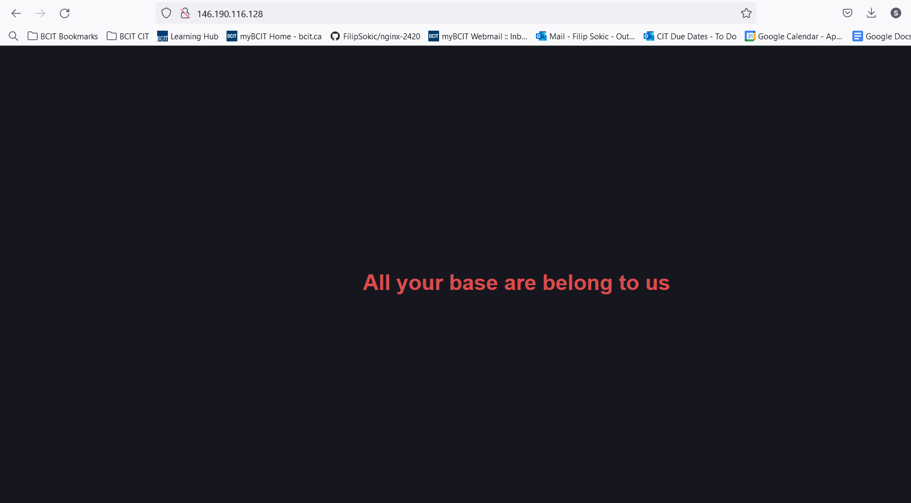

# Setting Up Nginx on Arch Linux with a Separate Server Block

This tutorial will guide you through setting up Nginx on a fresh Arch Linux server running on DigitalOcean, configuring it to serve a simple HTML document, and managing the Nginx service using systemd.

## Prerequisites

- A fresh Arch Linux server running on DigitalOcean.
- Basic knowledge of Linux command line.

## Step 1: Update Your System

First, ensure your system is up to date:

`sudo pacman -Syu`


## Step 2: Install Necessary Software

Install Nginx and Vim:

`sudo pacman -S nginx vim`


## Step 3: Start and Enable Nginx

Start the Nginx service 

`sudo systemctl start nginx`

Enable it to start on boot which ensures Nginx is always running, ready to serve web content:

`sudo systemctl enable nginx`


## Step 4: Create Project Directory

Create a new directory for your project (you can name it whatever you like):

 `sudo mkdir -p /web/html/nginx-2420`


## Step 5: Configure Nginx

### Create a Separate Server Block which will host your website 

Create a new directory for the config file (the preferred name is sites-available)

`sudo mkdir -p /etc/nginx/sites-available`


Create a new server block configuration file (you can name it whatever you like):

`sudo vim /etc/nginx/sites-available/nginx-2420.conf`

Write the follwing in the file:

```bash
server {
    listen 80;
    server_name your_DigitalOcean_droplet_ip;

    location / {
        root /web/html/nginx-2420;
        index index.html;
    }
}
```
The contents in server tell Nginx to listen for HTTP requests on port 80, responds to requests made to the IP address of your DigitalOcean droplet.
 
The contents in location let the server know where the html is. When the root URL is requested, it serves the file in the /web/html/nginx-2420 directory. 

### Enable the Server Block
This enables the server block configuration, making it active for Nginx to use

Create the sites-enabled directory for the symbolic link

`sudo mkdir -p /etc/nginx/sites-enabled`

Create a symbolic link to enable the server block. 

`sudo ln -s /etc/nginx/sites-available/nginx-2420.conf /etc/nginx/sites-enabled/`


### Test Nginx Configuration

Test the Nginx configuration for syntax errors so you know it works:

`sudo nginx -t`


If the configuration test is successful, reload Nginx to apply the changes:

`sudo systemctl reload nginx`


## Step 6: Add Your HTML Document

Create your HTML document:

`sudo vim /web/html/nginx-2420/index.html`

Write your HTML code:

```html
<!DOCTYPE html>
<html lang="en">
<head>
    <meta charset="UTF-8">
    <meta name="viewport" content="width=device-width, initial-scale=1.0">
    <title>2420</title>
    <style>
        * {
            color: #db4b4b;
            background: #16161e;
        }
        body {
            display: flex;
            align-items: center;
            justify-content: center;
            height: 100vh;
            margin: 0;
        }
        h1 {
            text-align: center;
            font-family: sans-serif;
        }
    </style>
</head>
<body>
    <h1>All your base are belong to us</h1>
</body>
</html>
```

## Step 7: Open Your Webpage

Open a browser and enter to your server's IP address or domain name. You should see your webpage.


It should look something like this:


## Conclusion

Congratulations! You've successfully set up Nginx on an Arch Linux server, configured a separate server block, and set up an HTML document